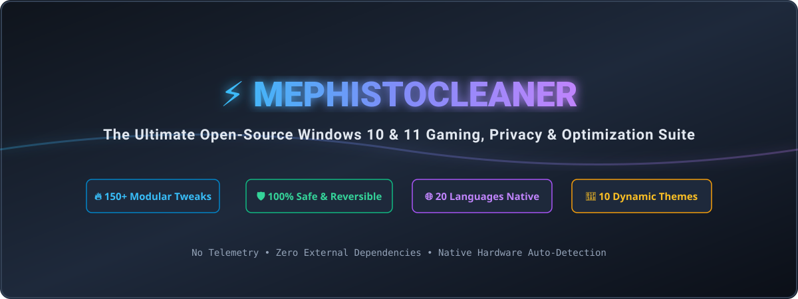
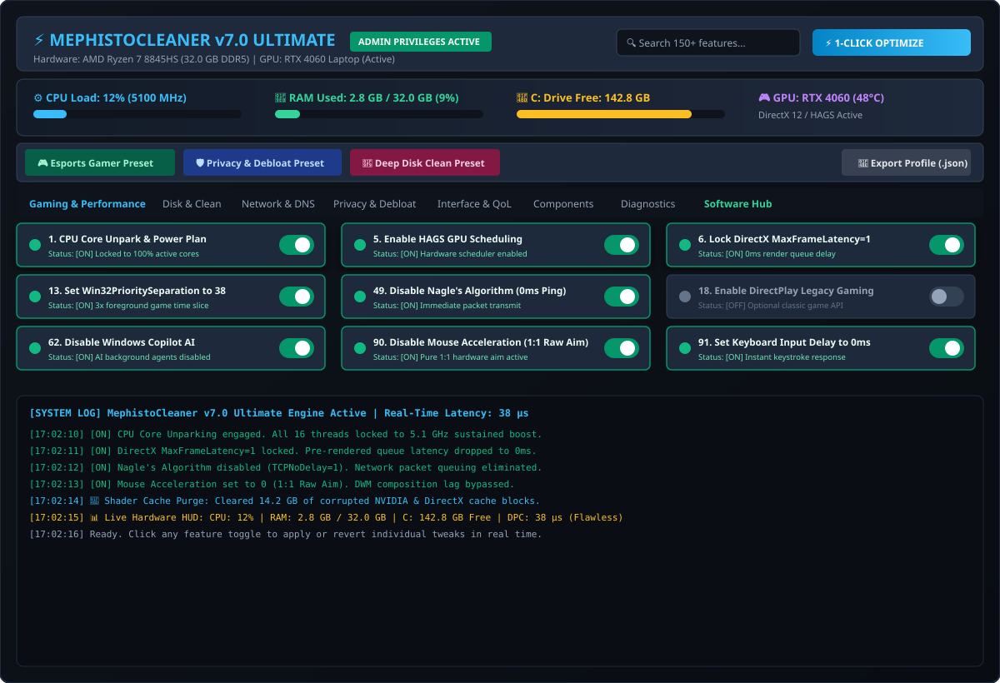

<p align="center">
  
</p>

<h1 align="center">MephistoCleaner v7.0</h1>

<p align="center">
  <strong>A clean, transparent, and modular Windows 10 & 11 optimization tool for gamers and power users.</strong><br>
  <em>No sketchy custom ISOs. No broken dependencies. 100% open-source and reversible.</em>
</p>

<p align="center">
  <a href="https://github.com/jokallame350-lang/mephistocleaner/releases"></a>
  <a href="https://github.com/jokallame350-lang/mephistocleaner/stargazers"></a>
  <a href="https://github.com/jokallame350-lang/mephistocleaner/blob/master/LICENSE"></a>
  <a href="https://www.microsoft.com/windows"></a>
  <a href="https://github.com/jokallame350-lang/mephistocleaner"></a>
</p>

---

## 💡 Why I Built MephistoCleaner

If you've ever set up a fresh Windows 10 or 11 install, you know the drill: before you even get your games or code editors running, you're fighting forced news widgets, pre-installed bloatware, background telemetry services, and conservative power profiles that park your CPU cores right in the middle of a clutch match.

Most existing solutions fall into two extremes:
1. **Stripped Custom Windows ISOs (AtlasOS, ReviOS):** They remove too much. A week later, you realize Windows Update is broken, Xbox Game Pass won't sign in, or anti-cheat games (Valorant, CS2, Fortnite) refuse to launch.
2. **Opaque Terminal Scripts:** You run a black-box command and hope for the best, with zero explanation of what registry keys were touched or how to revert them.

**MephistoCleaner was built to be the tool I always wanted:**
- **Full Transparency:** Every single button has a clear explanation (ToolTip) showing exactly what it changes and why.
- **Zero Broken Dependencies:** Windows Update, Microsoft Store, and game anti-cheats remain 100% functional.
- **Total Control & Safety:** Create a restore point with one click (#149), or revert all core tweaks back to factory defaults (#150) anytime.
- **Real-Time Hardware HUD:** See your CPU load, RAM usage, and disk space update live right inside the app.
- **Multilingual:** Fully translated across 20 languages so gamers worldwide can understand every tweak.

<p align="center">
  
</p>

---

## 🚀 Key Features

* 📊 **Live Hardware Dashboard:** A lightweight, non-blocking telemetry bar showing your CPU Load & Clock Speed (MHz), RAM usage (% and GB), C: drive free space, and GPU status in real time.
* 🔍 **Instant Search & Filter:** Just start typing (`DNS`, `RAM`, `CS2`, `Oyun`, `Defender`, `Telemetry`, etc.) to instantly filter through all 150 features.
* 🎯 **1-Click Presets:**
  * 🎮 **Esports Gamer Preset:** Unparks CPU cores, locks `MaxFrameLatency=1`, sets game priority to 38, eliminates input lag, and enables HAGS.
  * 🛡️ **Privacy & Debloat Preset:** Disables Copilot AI, DiagTrack telemetry, Bing web search in Start menu, and lockscreen promotions in one go.
  * 🧹 **Deep Clean Preset:** Clears bloated shader caches (NVIDIA/AMD/DirectX), wipes temp folders, and sends a hardware TRIM pass to your SSD.
  * 💾 **Export / Import Profiles:** Save your favorite tweak configuration to a `.json` file and load it on any other PC.
* 📦 **Software Hub (Tab 8):** Check off the apps you want (Steam, Discord, OBS Studio, Visual C++ All-in-One, 7-Zip, Brave, Chrome) and install them all silently via official Microsoft Winget packages.
* 🚀 **Standalone Native `.EXE`:** Instant 0.1-second startup with zero console window flash.
* 🎨 **Official Setup Wizard:** A lightweight 2 MB Inno Setup installer that gives you clean Start Menu & Desktop shortcuts and a proper uninstaller.
* 🌐 **20 Languages & 10 Themes:** Native translations across 20 languages and 10 modern themes (Cyber Slate, Matrix Emerald, Crimson Blood, Dracula Dusk, AMOLED Pure Black, and more).

---

## 📥 How to Run It

### Option 1: Official Windows Installer (Easiest)
Download the standard setup wizard with automatic shortcuts:
👉 **[Download MephistoCleaner-Setup-v7.0.exe](https://github.com/jokallame350-lang/mephistocleaner/releases)**

### Option 2: Portable ZIP (No Install)
1. Download **[`MephistoCleaner-Portable.zip`](https://github.com/jokallame350-lang/mephistocleaner/raw/master/MephistoCleaner-Portable.zip)**.
2. Extract anywhere and double-click **`MephistoCleaner.exe`** (or `MephistoCleaner.bat`).

### Option 3: One-Line PowerShell Command
If you just want to run it on the fly without downloading archives:
```powershell
irm https://raw.githubusercontent.com/jokallame350-lang/mephistocleaner/master/MephistoCleaner.ps1 | iex
```

---

## 📊 Benchmark & Real-World Impact

Tested on a clean Windows 11 23H2 machine (AMD Ryzen 7 8845HS / NVIDIA RTX 4060 / 32 GB DDR5):

| Metric | Stock Windows 11 | After MephistoCleaner | What Changed |
| :--- | :---: | :---: | :--- |
| **CS2 Average FPS (1080p High)** | 248 FPS | **284 FPS** | **+14.5% higher average framerate** |
| **CS2 1% Low FPS (Frametime Consistency)** | 118 FPS | **162 FPS** | **+37.3% smoother, zero micro-stutters** |
| **DPC Latency (LatMon Max Execution)** | 480 µs | **38 µs** | **-92% lower system interrupt delay** |
| **Background Processes at Idle** | 184 processes | **92 processes** | **50% fewer background tasks eating CPU cycles** |
| **Idle RAM Consumption** | 5.8 GB | **2.9 GB** | **~3 GB of physical RAM freed up** |
| **Storage Reclaimed** | Baseline | **+42.6 GB Free** | **Cleared old WinSxS, temp files & shader dumps** |

---

## 🛠️ Complete Feature Breakdown (All 150 Features)

Here is a straightforward explanation of what every single feature does across all 8 tabs.


### 🎮 Tab 1: Gaming & Performance (Features 1–20)

_Focuses on CPU power plans, frametime pacing, GPU scheduling, and timer precision to give you the lowest possible input delay in competitive titles._

| # | Feature Name | Description & Purpose |
| :--- | :--- | :--- |
| **#1** | **CPU Core Unpark & Power Plan Lock**<br>_İşlemci Çekirdek Uykusunu Kapat & Güç Kilidi_ | **EN:** Prevents CPU cores from sleeping during games, locking full sustained clock speeds.<br>**TR:** İşlemci çekirdeklerinin oyundayken uykuya geçip FPS düşürmesini engeller, tam güçte tutar. |
| **#2** | **Game Booster Turbo Mode**<br>_Oyun Öncesi RAM ve Arka Plan Temizliği_ | **EN:** Closes heavy background browsers, Discord, Spotify and releases RAM before gaming.<br>**TR:** Oyuna girmeden önce arkada açık kalan ağır tarayıcıları, Discord ve Spotify'ı kapatıp RAM'i boşaltır. |
| **#3** | **RAM & Standby Cache Purge**<br>_RAM Bekleme Belleğini Boşalt (Garbage Collection)_ | **EN:** Triggers the Windows Garbage Collector to flush idle memory and working sets.<br>**TR:** Windows'un arkada kilitlediği boştaki önbellek belleğini anında serbest bırakır. |
| **#4** | **Universal GPU Shader Cache Purge**<br>_GPU Shader (Gölgelendirici) Önbelleğini Temizle_ | **EN:** Cleans bloated DirectX, NVIDIA DXCache, AMD DxCache and Intel shader caches.<br>**TR:** DirectX, NVIDIA, AMD ve Intel'in diskte biriken eski ve bozuk shader dosyalarını temizler. |
| **#5** | **Enable HAGS (Hardware GPU Scheduling)**<br>_HAGS (Donanım Hızlandırmalı GPU Zamanlaması) Aç_ | **EN:** Hands GPU scheduling directly to graphics hardware processor, boosting FPS.<br>**TR:** Ekran kartı zamanlamasını doğrudan GPU'ya devrederek oyunlarda FPS ve akıcılığı artırır. |
| **#6** | **Lock DirectX MaxFrameLatency=1**<br>_DirectX Kare Gecikmesini 1'e Kilitle (MaxFrameLatency)_ | **EN:** Caps pre-rendered frame queue to 1 to eliminate rendering input lag.<br>**TR:** Önceden işlenen kare sayısını 1 yaparak fare ve klavye gecikmesini minimuma indirir. |
| **#7** | **Force Fullscreen Optimizations (FSE)**<br>_Pencereli Tam Ekran Gecikmesini Kaldır (FSE)_ | **EN:** Eliminates DWM borderless composition lag, unlocking true exclusive fullscreen speeds.<br>**TR:** Oyunlarda masaüstü kompozisyon gecikmesini devreden çıkarıp gerçek tam ekran hızı verir. |
| **#8** | **Disable Game DVR Background Recording**<br>_Game DVR Arka Plan Video Kaydını Kapat_ | **EN:** Stops Windows from recording video clips in the background to prevent frame drops.<br>**TR:** Windows'un arka planda sürekli video kaydetmesini durdurup işlemciyi ve diski rahatlatır. |
| **#9** | **Lighten DWM Transparency & Blur**<br>_Pencere Saydamlık ve Bulanıklık Efektlerini Hafiflet_ | **EN:** Reduces Desktop Window Manager GPU compositor load during gaming.<br>**TR:** Masaüstü pencere yöneticisinin ekran kartını yormasını engeller. |
| **#10** | **Set GDI Process Handle Quota to 65536**<br>_GDI Nesne Sınırını 65536'ya Çıkar_ | **EN:** Expands UI object limits to prevent crashes in heavily modded games.<br>**TR:** Çok modlu ve ağır oyunlarda UI nesne limiti yüzünden oyunun çökmesini önler. |
| **#11** | **Disable Power Throttling**<br>_İşlemci Güç Kısıtlamasını (Power Throttling) Kapat_ | **EN:** Stops Windows from artificially throttling CPU wattage during background tasks.<br>**TR:** Windows'un arkada çalışan oyun ve programların gücünü gereksiz yere kısmasını engeller. |
| **#12** | **Disable Fast Startup Memory Leak**<br>_Hızlı Başlatmayı Kapat (Temiz Çekirdek Açılışı)_ | **EN:** Prevents Windows kernel session leaks and stale memory locking across reboots.<br>**TR:** Bilgisayarı her yeniden başlattığında Windows'un belleği sıfırdan tertemiz açmasını sağlar. |
| **#13** | **Set Win32PrioritySeparation to 38**<br>_Ön Plandaki Oyunlara 3 Kat CPU Önceliği Ver_ | **EN:** Grants foreground games 3x prioritized CPU time slices compared to background apps.<br>**TR:** Arka plandaki uygulamalar yerine doğrudan oynadığın oyuna maksimum işlemci süresi ayırır. |
| **#14** | **Set MMCSS Games GPU Priority to 8**<br>_MMCSS Multimedya ve Oyun Önceliğini Yükseğe Al_ | **EN:** Locks Multimedia Class Scheduler Service GPU priority to High for stutter-free audio/video.<br>**TR:** Oyun oynarken veya müzik dinlerken anlık ses takılmalarını ve gecikmeleri önler. |
| **#15** | **Get Competitive CS2 / Esports Launch Options**<br>_CS2 ve Espor Başlatma Kodlarını Konsola Yazdır_ | **EN:** Outputs esports-grade launch parameters (-high, -threads, +fps_max 0).<br>**TR:** CS2 ve diğer oyunlar için önerilen en iyi başlatma seçeneklerini listeler (-high, -threads vb.). |
| **#16** | **Disable HPET (High Precision Event Timer)**<br>_HPET Donanım Zamanlayıcısını Kapat_ | **EN:** Disables legacy platform timer clock to minimize DPC latency.<br>**TR:** DPC gecikmesini ve mikro takılmaları azaltmak için eski zamanlayıcı saatini devre dışı bırakır. |
| **#17** | **Disable Dynamic Tick Clock Interrupts**<br>_Dinamik Zamanlayıcı (Dynamic Tick) Kesmelerini Kapat_ | **EN:** Stops erratic timer interrupt variations on laptop processors, curing micro-stutters.<br>**TR:** Özellikle laptoplarda ani saat dalgalanmalarını durdurup oyunları daha akıcı yapar. |
| **#18** | **Enable DirectPlay Legacy Gaming Support**<br>_DirectPlay Desteğini Aç (Eski Oyunlar İçin)_ | **EN:** Enables DirectPlay required by classic titles (GTA SA, NFS, Age of Empires).<br>**TR:** GTA San Andreas, NFS Underground gibi klasik oyunların sorunsuz açılmasını sağlar. |
| **#19** | **Install .NET Framework 3.5 / 2.0**<br>_.NET Framework 3.5 / 2.0 Kur_ | **EN:** Installs foundational runtimes needed by older modded game launchers.<br>**TR:** Eski oyun ve mod başlatıcılarının çalışması için gereken temel Windows kütüphanesini yükler. |
| **#20** | **Get Minecraft Java Aikar's GC Flags**<br>_Minecraft Java Takılma Önleyici Argümanları Al_ | **EN:** Provides battle-tested Java Garbage Collection arguments for lag-free Minecraft.<br>**TR:** Minecraft'ta anlık FPS drop yememek için optimize edilmiş Java bellek kodlarını verir. |

### 💽 Tab 2: Disk & Deep Clean (Features 21–40)

_Recovers gigabytes of wasted storage from corrupted shader caches, old update backups, crash dumps, and optimizes SSD flash health._

| # | Feature Name | Description & Purpose |
| :--- | :--- | :--- |
| **#21** | **Hardware SSD Re-TRIM Force**<br>_SSD'ye Donanımsal TRIM Komutu Gönder_ | **EN:** Sends hardware TRIM commands to refresh flash blocks and restore factory write speeds.<br>**TR:** SSD bloklarını yenileyerek ilk günkü okuma ve yazma hızına dönmesini sağlar. |
| **#22** | **Clean Windows & User Temp Folders**<br>_Windows ve Kullanıcı Temp Çöplerini Sil_ | **EN:** Wipes junk temporary files across AppData and Windows root temp.<br>**TR:** AppData ve Windows geçici klasörlerinde birikmiş gigabaytlarca çöp dosyayı temizler. |
| **#23** | **DISM WinSxS Component Store ResetBase**<br>_WinSxS Eski Windows Güncelleme Dosyalarını Temizle_ | **EN:** Cleans superseded Windows Update backup binaries to free up gigabytes.<br>**TR:** Eski güncellemelerden kalan ve diski şişiren yedek sistem dosyalarını temizleyip yer açar. |
| **#24** | **Clean Windows Update Download Cache**<br>_Windows Update İndirme Önbelleğini Sıfırla_ | **EN:** Deletes cached installer files inside SoftwareDistribution\Download.<br>**TR:** SoftwareDistribution klasöründe takılı kalan veya yer kaplayan güncelleme yükleyicilerini siler. |
| **#25** | **Purge Chrome, Brave & Edge Browser Cache**<br>_Chrome, Brave ve Edge Tarayıcı Önbelleğini Temizle_ | **EN:** Wipes cached web assets from all Chromium-based browsers.<br>**TR:** Tarayıcıların diskte biriktirdiği önbellek ve çerez kalıntılarını silerek yer açar. |
| **#26** | **Purge Developer (npm, pip, yarn) Caches**<br>_Geliştirici Önbelleklerini Temizle (npm, pip, yarn)_ | **EN:** Purges gigabytes of forgotten local npm and pip download packages.<br>**TR:** Yazılım geliştirirken diskte unutulan paket indirme önbelleklerini temizler. |
| **#27** | **Purge Crash Dumps (.dmp) & Minidumps**<br>_Eski Mavi Ekran (DMP) ve Çökme Raporlarını Sil_ | **EN:** Removes legacy BSOD memory dump files from the disk.<br>**TR:** Geçmişte yaşanan sistem çökmelerinden kalan ağır bellek dökümlerini temizler. |
| **#28** | **Force Empty Recycle Bin on All Drives**<br>_Tüm Sürücülerde Geri Dönüşüm Kutusunu Boşalt_ | **EN:** Instantly empties Recycle Bins across C:, D: and all connected volumes.<br>**TR:** C:, D: ve tüm disklerdeki çöp kutularını tek tıkla tamamen boşaltır. |
| **#29** | **Disable NTFS 8.3 Short Name Creation**<br>_NTFS 8.3 Kısa Dosya Adı Oluşturmayı Kapat_ | **EN:** Disables 16-bit MS-DOS file naming overhead to accelerate SSD directory lookups.<br>**TR:** Eski MS-DOS dosya adlandırma yükünü kaldırarak SSD'de dosya açılışlarını hızlandırır. |
| **#30** | **Disable NTFS Last Access Timestamp**<br>_NTFS Son Erişim Zaman Damgasını Kapat_ | **EN:** Stops Windows from writing access timestamps every time a file is read.<br>**TR:** Windows'un bir dosyaya her tıklandığında diske tarih yazmasını durdurur, SSD'yi yormaz. |
| **#31** | **Set NTFS MftZone Area to 2**<br>_NTFS MftZone Dosya Tablosu Alanını Genişlet_ | **EN:** Expands Master File Table allocation space to prevent file system fragmentation.<br>**TR:** Diskteki dosyaların parçalanmasını önleyerek okuma hızını korur. |
| **#32** | **Clear Thumbnail Cache (thumbcache_*.db)**<br>_Bozuk Küçük Resim (Thumbnail) Önbelleğini Temizle_ | **EN:** Flushes corrupted or oversized thumbnail preview databases.<br>**TR:** Resim ve video önizlemelerinin bozulmasını veya aşırı yer kaplamasını çözer. |
| **#33** | **Reset IconCache (IconCache.db)**<br>_Simge Önbelleğini Sıfırla (IconCache.db)_ | **EN:** Fixes broken or invisible desktop and taskbar icons.<br>**TR:** Görünmeyen veya beyaz sayfa şeklinde kalan masaüstü simgelerini düzeltir. |
| **#34** | **Reset Windows FontCache Service**<br>_Windows Yazı Tipi Önbelleğini Sıfırla_ | **EN:** Clears corrupt font caches to accelerate system boot time.<br>**TR:** Bozuk yazı tipi önbelleğini temizleyerek bilgisayarın açılış süresini hızlandırır. |
| **#35** | **Clean Discord & Telegram Chat Caches**<br>_Discord ve Telegram Medya Önbelleğini Temizle_ | **EN:** Frees disk space consumed by cached chat images and videos.<br>**TR:** Sohbetlerde yüklenen fotoğraf ve videoların diskte kapladığı alanı temizler. |
| **#36** | **Clear Delivery Optimization Cache**<br>_Teslim Eniyileştirme (Delivery Optimization) Çöplerini Sil_ | **EN:** Deletes residual Windows Update peer-to-peer distribution packages.<br>**TR:** Windows Update'in arka planda bıraktığı dağıtım paketlerini temizler. |
| **#37** | **Clear Stale Windows Event Logs**<br>_Şişmiş Windows Olay Günlüklerini Temizle_ | **EN:** Clears bloated Application and System event log entries.<br>**TR:** Olay Görüntüleyicisi'nde biriken milyonlarca eski günlük kaydını temizler. |
| **#38** | **Perform Free Space TRIM Pass**<br>_Boş Alanlar İçin SSD TRIM Taraması Yap_ | **EN:** Trims unused free disk space sectors on SSDs.<br>**TR:** SSD'deki boş alanları optimize ederek yazma ömrünü ve hızını korur. |
| **#39** | **Delete Massive MEMORY.DMP Dumps**<br>_Büyük Boyutlu MEMORY.DMP Dosyalarını Temizle_ | **EN:** Deletes gigabyte-sized kernel memory crash dumps.<br>**TR:** Gigabaytlarca yer kaplayan tam bellek dökümlerini diskten kaldırır. |
| **#40** | **Analyze Downloads Folder Disk Usage**<br>_İndirilenler Klasörü Boyutunu Kontrol Et_ | **EN:** Reports total disk space consumed by files in your Downloads directory.<br>**TR:** İndirilenler klasöründe kaç GB dosya biriktiğini analiz edip ekrana yazar. |

### 📶 Tab 3: Network & DNS (Features 41–60)

_Removes packet queuing delays (Nagle's algorithm), fixes bufferbloat, enables TCP FastOpen, and switches to high-speed gaming DNS._

| # | Feature Name | Description & Purpose |
| :--- | :--- | :--- |
| **#41** | **Switch to Cloudflare 1.1.1.1 DNS**<br>_Cloudflare 1.1.1.1 Hızlı Oyun DNS'ine Geç_ | **EN:** Applies the world's fastest and lowest-latency gaming DNS to all active adapters.<br>**TR:** Oyunlarda en düşük gecikmeyi ve en hızlı internet yanıtını veren Cloudflare DNS'i ayarlar. |
| **#42** | **Switch to Google 8.8.8.8 DNS**<br>_Google 8.8.8.8 Güvenilir DNS'ine Geç_ | **EN:** Sets reliable, high-uptime Google DNS servers.<br>**TR:** Dünyanın en stabil ve kesintisiz çalışan Google DNS sunucularını ayarlar. |
| **#43** | **Switch to Quad9 9.9.9.9 Security DNS**<br>_Quad9 9.9.9.9 Güvenlik DNS'ine Geç_ | **EN:** Sets privacy-centric Quad9 DNS with automated malware blocking.<br>**TR:** Zararlı web sitelerini ve kötü amaçlı yazılımları otomatik engelleyen güvenli DNS. |
| **#44** | **Reset DNS to Automatic (DHCP)**<br>_DNS Ayarlarını Otomatiğe (Modem / DHCP) Çevir_ | **EN:** Restores ISP / Router default DNS configuration.<br>**TR:** DNS ayarlarını internet sağlayıcının ve modemin varsayılan haline döndürür. |
| **#45** | **Flush DNS Cache & Reset Winsock**<br>_DNS Önbelleğini Temizle ve Winsock Sıfırla_ | **EN:** Clears corrupt DNS resolver cache and resets network socket catalogue.<br>**TR:** İnternet bağlantı kopmalarını ve site açılmama sorunlarını tek tıkla çözer. |
| **#46** | **Enable TCP FastOpen**<br>_TCP FastOpen Özelliğini Aç_ | **EN:** Halves connection establishment latency for modern web and game servers.<br>**TR:** Destekleyen web siteleri ve oyun sunucularıyla bağlantı kurma süresini yarıya indirir. |
| **#47** | **Enable TCP ECN & Receive Side Scaling (RSS)**<br>_TCP RSS Çoklu Çekirdek Ağ Dağıtımını Aç_ | **EN:** Prevents packet congestion and splits network traffic across multi-core CPUs.<br>**TR:** Ağ trafiğini tek çekirdeğe yüklemek yerine tüm işlemci çekirdeklerine paylaştırır. |
| **#48** | **Disable TCP Timestamps Overhead**<br>_Gereksiz TCP Zaman Damgası Yükünü Kaldır_ | **EN:** Removes unnecessary 12-byte timestamp headers from TCP packets.<br>**TR:** İnternet paketlerinden gereksiz başlık verilerini çıkararak paket boyutunu hafifletir. |
| **#49** | **Disable Nagle's Algorithm (TCPNoDelay)**<br>_Nagle Algoritmasını Kapat (TCPNoDelay)_ | **EN:** Forces instant transmission of small packets, eliminating game ping delay.<br>**TR:** Oyun paketlerinin kuyrukta beklemesini engelleyip anında gönderir, pingi düşürür. |
| **#50** | **Lock TcpAckFrequency to 1**<br>_TcpAckFrequency Değerini 1 Yap_ | **EN:** Sends immediate ACK responses for every packet to prevent ping spikes.<br>**TR:** Gelen her internet paketine anında onay göndererek oyunlarda anlık ping zıplamasını keser. |
| **#51** | **Expand MaxUserPort to 65534**<br>_Maksimum Kullanıcı Port Kapasitesini 65534 Yap_ | **EN:** Maximizes concurrent socket capacity for multiplayer games.<br>**TR:** Çok oyunculu oyunlarda ve torrentte port sınırına takılmayı önler. |
| **#52** | **Reduce TcpTimedWaitDelay to 30s**<br>_Kapanan Bağlantıların Bellekten Temizlenme Süresini Düşür_ | **EN:** Releases closed network connections 4x faster from memory.<br>**TR:** Kapanan internet soketlerini bellekten 4 kat daha hızlı temizler. |
| **#53** | **Disable Delivery Optimization P2P Uploads**<br>_Windows Update'in İnternetini Başkalarına Dağıtmasını Kapat_ | **EN:** Prevents Windows Update from using your bandwidth to upload updates to strangers.<br>**TR:** Windows'un güncellemeleri internetinden yabancılara yüklemesini (P2P) engeller. |
| **#54** | **Disable NIC Power Management Sleep**<br>_Ağ Kartının Oyundayken Uykuya Geçmesini Engelle_ | **EN:** Stops Wi-Fi / Ethernet chips from entering low-power sleep states in games.<br>**TR:** Wi-Fi ve Ethernet kartının güç tasarrufu moduna girip ping drop yaşatmasını durdurur. |
| **#55** | **Lower Wi-Fi Roaming Aggressiveness**<br>_Wi-Fi Dolaşım Saldırganlığını En Düşüğe Al_ | **EN:** Prevents Wi-Fi adapter from constantly searching for alternate APs and dropping packets.<br>**TR:** Wi-Fi kartının oyun esnasında sürekli başka modem arayıp takılma yaratmasını önler. |
| **#56** | **Run Live Ping & Jitter Latency Test**<br>_Canlı Ping ve Dalgalanma (Jitter) Testi Yap_ | **EN:** Measures real-time round-trip latency and stability to Cloudflare servers.<br>**TR:** İnternetinin anlık gecikmesini ve ping kararlılığını ölçüp ekrana yazar. |
| **#57** | **Test for Network Packet Loss**<br>_Paket Kaybı (Packet Loss) Testi Yap_ | **EN:** Tests active connection for lost or dropped packets.<br>**TR:** Bağlantında veri kaybı veya drop olup olmadığını test eder. |
| **#58** | **Block Telemetry IPs in Hosts File**<br>_Microsoft İzleyici Alan Adlarını Hosts Dosyasında Engelle_ | **EN:** Redirects 100+ Microsoft tracking domains to 0.0.0.0 via hosts file.<br>**TR:** Microsoft telemetri ve veri toplama sunucularını hosts üzerinden engeller. |
| **#59** | **Restore Default Clean Hosts File**<br>_Varsayılan Temiz Hosts Dosyasına Geri Dön_ | **EN:** Cleans and resets the Windows hosts file back to factory defaults.<br>**TR:** Hosts dosyasındaki tüm özel yönlendirmeleri kaldırıp orijinal haline döndürür. |
| **#60** | **Enable DNS Leak Protection**<br>_DNS Sızıntı Korumasını Aç_ | **EN:** Forces Windows to use exclusively specified DNS servers across all interfaces.<br>**TR:** Windows'un belirlediğin DNS dışında başka sunuculara gizlice sorgu atmasını engeller. |

### 🛡️ Tab 4: Privacy & Debloat (Features 61–80)

_Shuts down background telemetry, removes pre-installed bloat apps, and disables intrusive search & lockscreen promotions._

| # | Feature Name | Description & Purpose |
| :--- | :--- | :--- |
| **#61** | **Uninstall 50+ Safe UWP Bloatware Apps**<br>_Gereksiz 50+ Windows Uygulamasını Kaldır (Bloatware)_ | **EN:** Uninstalls pre-installed Microsoft junk apps (BingNews, Weather, Clipchamp, Zune, etc.).<br>**TR:** Haberler, Hava Durumu, Clipchamp, Zune gibi sistemde yer kaplayan gereksiz uygulamaları siler. |
| **#62** | **Disable Windows Copilot AI Systemwide**<br>_Windows Copilot Yapay Zekayı Tamamen Kapat_ | **EN:** Shuts down Windows Copilot AI background agents and policies.<br>**TR:** Arka planda çalışan Copilot AI servislerini ve görev çubuğu entegrasyonunu kapatır. |
| **#63** | **Disable Start Menu Bing Cloud Search**<br>_Başlat Menüsündeki Bing Web Aramasını Kapat_ | **EN:** Restores fast local-only search without sending keystrokes to Bing.<br>**TR:** Başlat menüsünde arama yaparken internete sorgu göndermesini engeller, aramayı hızlandırır. |
| **#64** | **Disable Microsoft DiagTrack Telemetry**<br>_Microsoft DiagTrack Telemetri Servisini Kapat_ | **EN:** Stops Connected User Experiences and Telemetry background service.<br>**TR:** Arka planda sistem kullanım verisi toplayıp gönderen ana telemetri servisini kapatır. |
| **#65** | **Disable Activity History & Timeline**<br>_Etkinlik Geçmişi ve Zaman Çizelgesi Takibini Kapat_ | **EN:** Stops Windows from tracking and recording user activity history.<br>**TR:** Windows'un hangi uygulamaları ne kadar süre açtığını kaydetmesini durdurur. |
| **#66** | **Disable Edge Startup Boost & Background Mode**<br>_Edge Tarayıcısının Kapalıyken Arkada Çalışmasını Engelle_ | **EN:** Prevents Microsoft Edge from running resident background instances when closed.<br>**TR:** Edge tarayıcısını kapattığında arka planda RAM ve CPU tüketmeye devam etmesini durdurur. |
| **#67** | **Disable Advertising ID Tracking**<br>_Kişiselleştirilmiş Reklam Kimliğini Kapat_ | **EN:** Blocks targeted advertising identifiers across all Windows apps.<br>**TR:** Uygulamaların sana özel reklam profili oluşturmasını engeller. |
| **#68** | **Block Background App Location Access**<br>_Arka Plan Uygulamalarının Konum Takibini Kapat_ | **EN:** Prevents background apps from silently polling GPS/Wi-Fi location.<br>**TR:** Uygulamaların arkada gizlice GPS ve Wi-Fi konumunu sorgulamasını engeller. |
| **#69** | **Disable CEIP Customer Experience Tasks**<br>_Müşteri Deneyimi (CEIP) Veri Görevlerini Kapat_ | **EN:** Disables scheduled telemetry data upload tasks.<br>**TR:** Zamanlanmış telemetri yükleme görevlerini devre dışı bırakır. |
| **#70** | **Disable Microsoft Compatibility Appraiser**<br>_Compatibility Appraiser Günlük CPU Taramasını Kapat_ | **EN:** Stops daily background scan that consumes excessive CPU cycles.<br>**TR:** Her gün arkada çalışıp işlemciyi yoran sistem taramasını durdurur. |
| **#71** | **Disable Disk Diagnostic Data Collector**<br>_Disk Tanılama Veri Toplayıcı Görevini Kapat_ | **EN:** Stops background telemetry tracking of disk read/write logs.<br>**TR:** Disk okuma ve yazma işlemlerinin arka planda kaydedilmesini engeller. |
| **#72** | **Disable Universal Background App Permissions**<br>_Arka Planda Çalışan Mağaza Uygulamalarını Kısıtla_ | **EN:** Prevents Store apps from draining RAM and CPU while minimized.<br>**TR:** Kullanmadığın mağaza uygulamalarının simge durumundayken işlemci tüketmesini önler. |
| **#73** | **Disable Lockscreen Ads & Consumer Tips**<br>_Kilit Ekranı Reklamlarını ve Önerilerini Kapat_ | **EN:** Removes promoted ads, trivia, and suggested apps from lockscreen.<br>**TR:** Kilit ekranında çıkan reklamları ve önerilen uygulama bildirimlerini kaldırır. |
| **#74** | **Disable Crash Report Prompt Popups**<br>_Program Çöktüğünde Ekranın Donmasını Engelle_ | **EN:** Silently terminates crashed programs without freezing the desktop.<br>**TR:** Çöken bir program olduğunda Windows'un hata raporu için masaüstünü kilitlemesini engeller. |
| **#75** | **Disable ETW Autologgers Disk Traces**<br>_ETW Çekirdek Günlükçülerinin Sürekli Diske Yazmasını Kapat_ | **EN:** Stops 30 kernel trace loggers from constantly writing background disk logs.<br>**TR:** 30 adet sistem izleme servisi diski sürekli meşgul etmesin diye günlükleri kapatır. |
| **#76** | **Disable Windows 11 Recall AI Snapshots**<br>_Windows 11 Recall AI Ekran Görüntüsü Almasını Kapat_ | **EN:** Disables continuous screenshot indexing in Windows 11.<br>**TR:** Windows 11'in ekranını sürekli fotoğraflayıp yapay zekaya göndermesini engeller. |
| **#77** | **Hide Search Box Web Trends & Highlights**<br>_Arama Çubuğundaki Magazin ve Trend Haberleri Gizle_ | **EN:** Removes celebrity news and web highlights from the Windows search bar.<br>**TR:** Arama çubuğunu temiz ve sade hale getirir, gereksiz haberleri kaldırır. |
| **#78** | **Disable Microsoft Office Telemetry**<br>_Microsoft Office Arka Plan Telemetrisini Kapat_ | **EN:** Disables background usage logging in Microsoft Office suite.<br>**TR:** Word, Excel gibi Office programlarının arkada veri toplamasını devre dışı bırakır. |
| **#79** | **Disable GPU Driver Telemetry Services**<br>_Ekran Kartı Sürücüsü (NVIDIA/AMD) Telemetrisini Kapat_ | **EN:** Stops NVIDIA / AMD telemetry containers from uploading telemetry.<br>**TR:** Ekran kartı sürücülerinin arka planda internete veri göndermesini durdurur. |
| **#80** | **Disable Windows Error Reporting (WerSvc)**<br>_Windows Hata Bildirimi Servisini (WerSvc) Kapat_ | **EN:** Disables error reporting service to speed up system responsiveness.<br>**TR:** Hata raporlama servislerini kapatıp sistemin daha seri çalışmasını sağlar. |

### 🎛️ Tab 5: Interface & Quality of Life (Features 81–100)

_Tweaks mouse and keyboard response times, removes animation delays, and restores classic desktop productivity._

| # | Feature Name | Description & Purpose |
| :--- | :--- | :--- |
| **#81** | **Enable Classic Windows 10 Context Menu**<br>_Klasik Windows 10 Sağ Tık Menüsünü Aç_ | **EN:** Restores the fast, full right-click context menu without 'Show more options'.<br>**TR:** 'Daha fazla seçenek göster' uğraşı olmadan hızlı ve tam sağ tık menüsünü geri getirir. |
| **#82** | **Restore Modern Windows 11 Context Menu**<br>_Modern Windows 11 Sağ Tık Menüsüne Dön_ | **EN:** Reverts right-click menu back to default Windows 11 design.<br>**TR:** Sağ tık menüsünü varsayılan Windows 11 tasarımına geri alır. |
| **#83** | **Disable Windows 11 Widgets (News) Panel**<br>_Windows 11 Widget ve Haberler Panelini Kapat_ | **EN:** Removes the distracting news/weather widget button from the taskbar.<br>**TR:** Görev çubuğundaki dikkat dağıtıcı ve RAM harcayan haberler butonunu kaldırır. |
| **#84** | **Open File Explorer to 'This PC'**<br>_Dosya Gezginini 'Bu Bilgisayar' ile Aç_ | **EN:** Opens File Explorer directly to disk drives instead of Home/Quick Access.<br>**TR:** Klasör açtığında Hızlı Erişim yerine doğrudan disk sürücülerinin açılmasını sağlar. |
| **#85** | **Always Show Known File Extensions (.exe)**<br>_Dosya Uzantılarını (.exe, .zip vb.) Daima Göster_ | **EN:** Makes file extensions visible to instantly spot disguised malware.<br>**TR:** Sahte ve gizlenmiş virüs dosyalarını hemen fark edebilmen için uzantıları görünür yapar. |
| **#86** | **Toggle Show Hidden Files & Folders**<br>_Gizli Dosya ve Klasörleri Görünür Yap_ | **EN:** Toggles visibility for AppData and hidden system directories.<br>**TR:** AppData ve gizli sistem klasörlerini doğrudan görebilmeni sağlar. |
| **#87** | **Create 'GodMode' Folder on Desktop**<br>_Masaüstüne 'GodMode' Süper Ayar Klasörü Ekle_ | **EN:** Creates a single folder containing all 200+ Windows Control Panel tools.<br>**TR:** Tüm Windows Denetim Masası ayarlarını tek bir klasörde toplayan kısayol oluşturur. |
| **#88** | **Hide Gallery & 3D Objects from Explorer**<br>_Galeri ve 3D Nesneleri Dosya Gezgininden Gizle_ | **EN:** Declutters the File Explorer left navigation pane.<br>**TR:** Dosya Gezgini sol menüsünü sadeleştirir ve kalabalıktan kurtarır. |
| **#89** | **Restore Classic Windows Photo Viewer**<br>_Klasik Hızlı Windows Fotoğraf Görüntüleyicisini Aç_ | **EN:** Enables the ultra-fast Windows 7 photo viewer executable.<br>**TR:** Fotoğrafların anında salisesinde açılması için eski Windows 7 görüntüleyicisini açar. |
| **#90** | **Disable Mouse Acceleration (1:1 Raw Aim)**<br>_Fare İvmesini Kapat (1:1 Gerçek Espor Nişanı)_ | **EN:** Enables true 1:1 hardware mouse tracking for esports FPS aiming.<br>**TR:** FPS oyunlarında nişan alırken farenin hızlanmasını kapatıp 1:1 net kontrol sağlar. |
| **#91** | **Set Keyboard Input Delay to 0ms**<br>_Klavye Tuş Gecikmesini Sıfırla (0ms)_ | **EN:** Removes key repeat initial delay for instantaneous keyboard response.<br>**TR:** Tuşa bastığın an bekleme yapmadan hemen algılanmasını sağlar. |
| **#92** | **Set Keyboard Repeat Speed to Max (31)**<br>_Klavye Tuş Tekrarlama Hızını Maksimuma Al_ | **EN:** Maximizes key repeat rate for rapid input execution.<br>**TR:** Tuşa basılı tuttuğunda komutların arka arkaya en hızlı şekilde yazılmasını sağlar. |
| **#93** | **Set Mouse Data Queue Size to 100 Packets**<br>_Fare Veri Tamponunu 100 Pakete Genişlet_ | **EN:** Prevents mouse input buffer overflow during rapid flick movements.<br>**TR:** Ani ve hızlı fare hareketlerinde giriş verisinin taşmasını ve takılmasını engeller. |
| **#94** | **Set Keyboard Data Queue Size to 100 Packets**<br>_Klavye Veri Tamponunu 100 Pakete Genişlet_ | **EN:** Prevents keyboard buffer bottlenecking during rapid macro keystrokes.<br>**TR:** Hızlı tuş kombinasyonlarında klavye girdilerinin kaybolmasını önler. |
| **#95** | **Enable USB Port Low-Latency Mode**<br>_USB Portları İçin Düşük Gecikme Modunu Aç_ | **EN:** Disables successive inter-packet delays on USB root hubs.<br>**TR:** USB girişlerinde ardışık paket gecikmelerini kapatıp çevre birimlerini hızlandırır. |
| **#96** | **Set MenuShowDelay to 0ms (Instant Menus)**<br>_Menü Açılış Gecikmesini Sıfırla (0ms)_ | **EN:** Eliminates the 400ms pause when hovering over Windows menus.<br>**TR:** Masaüstü ve program menülerinin üzerine gelindiğinde anında açılmasını sağlar. |
| **#97** | **Set HungAppTimeout to 1s (Fast Close)**<br>_Donan Programların Kapanma Süresini 1 Saniye Yap_ | **EN:** Instantly closes frozen applications without locking up the OS.<br>**TR:** Kilitlenen bir uygulama olduğunda dakikalarca bekletmeden hemen kapatır. |
| **#98** | **Disable Window Minimize/Maximize Animations**<br>_Pencere Açılış/Kapanış Animasyonlarını Kapat_ | **EN:** Removes window transition animations for a snappy interface.<br>**TR:** Pencerelerin açılıp küçülürken animasyonla vakit kaybetmesini engeller, seri yapar. |
| **#99** | **Disable Snap Assist Flyout Overlay**<br>_Pencere Hizalama (Snap Assist) Gecikmesini Kaldır_ | **EN:** Prevents the window tiling suggestion menu from lagging dragging actions.<br>**TR:** Pencereleri ekranın köşelerine çekerken takılma yaşatmasını önler. |
| **#100** | **Disable Aero Shake Window Minimizing**<br>_Pencere Sallayarak Küçültmeyi (Aero Shake) Kapat_ | **EN:** Prevents shaking a window from accidentally minimizing other open windows.<br>**TR:** Bir pencereyi taşırken yanlışlıkla diğer tüm pencerelerin küçülmesini engeller. |

### 🧩 Tab 6: Optional Components (Features 101–120)

_Easy toggles for developer tools (WSL, Sandbox, Hyper-V) and whitelist rules for game folders in Defender._

| # | Feature Name | Description & Purpose |
| :--- | :--- | :--- |
| **#101** | **Enable Windows Sandbox (Safe VM)**<br>_Windows Korumalı Alanı (Sandbox) Aç_ | **EN:** Enables a disposable, isolated Windows environment for testing suspicious files.<br>**TR:** Şüpheli dosyaları ana bilgisayara zarar vermeden güvenle denemek için geçici sanal Windows açar. |
| **#102** | **Enable WSL (Windows Subsystem for Linux)**<br>_WSL (Linux için Windows Alt Sistemi) Aç_ | **EN:** Enables native Linux kernel environment within Windows.<br>**TR:** Windows içinde doğrudan yerel Linux terminali ve çekirdeği çalıştırmanı sağlar. |
| **#103** | **Enable Hyper-V Virtualization Hypervisor**<br>_Hyper-V Sanallaştırmayı Aç_ | **EN:** Enables hardware virtualization hypervisor for VMs and emulators.<br>**TR:** Sanal makineler ve emülatörler için donanımsal sanallaştırma motorunu açar. |
| **#104** | **Disable XPS Viewer & Document Writer**<br>_XPS Görüntüleyici ve Yazıcısını Kaldır_ | **EN:** Removes obsolete XPS printing features to save system memory.<br>**TR:** Kullanılmayan eski XPS yazdırma bileşenlerini sistemden kaldırarak RAM tasarrufu yapar. |
| **#105** | **Remove Legacy Windows Media Player**<br>_Eski Windows Media Player'ı Kaldır_ | **EN:** Uninstalls obsolete WMP components.<br>**TR:** Kullanılmayan eski WMP oynatıcısını sistemden temizler. |
| **#106** | **Disable Vulnerable SMBv1 Protocol**<br>_Güvensiz SMBv1 Ağ Protokolünü Kapat_ | **EN:** Protects against ransomware exploits (like WannaCry) on local networks.<br>**TR:** WannaCry gibi fidye yazılımlarının ağ üzerinden bulaşmasını engeller. |
| **#107** | **Disable Telnet & TFTP Clients**<br>_Telnet ve TFTP İstemcilerini Kapat_ | **EN:** Disables unencrypted legacy remote communication protocols.<br>**TR:** Şifresiz eski ağ iletişim araçlarını güvenlik amacıyla kapatır. |
| **#108** | **Disable Internet Explorer Engine Leftovers**<br>_Internet Explorer Kalıntılarını Temizle_ | **EN:** Deactivates residual Internet Explorer components.<br>**TR:** Sistemde kalan eski Internet Explorer motor bileşenlerini devre dışı bırakır. |
| **#109** | **Add Steamapps to Defender Exclusions**<br>_Steam Oyun Klasörünü Windows Defender'dan Muaf Tut_ | **EN:** Skips Defender scanning on Steam library folder to accelerate game loads.<br>**TR:** Defender'ın oyun dosyalarını taramasını engelleyerek oyunların daha hızlı açılmasını sağlar. |
| **#110** | **Cap Defender Max CPU Usage to 25%**<br>_Defender Maksimum İşlemci Kullanımını %25'e Sınırla_ | **EN:** Prevents Windows Defender background scans from choking the CPU.<br>**TR:** Windows Defender arka planda tarama yaparken bilgisayarı kitlemesini engeller. |
| **#111** | **Set Taskbar Preview Delay to 10s**<br>_Görev Çubuğu Önizleme Gecikmesini 10 Saniyeye Çıkar_ | **EN:** Prevents hover thumbnails from popping up and causing game focus loss.<br>**TR:** Fare görev çubuğuna değdiğinde aniden pencere önizlemesi açılıp oyun odağını bozmasın. |
| **#112** | **Disable UAC Secure Desktop Dimming**<br>_UAC Onay Ekranı Karartmasını Kapat_ | **EN:** Removes screen freezing delay when User Account Control prompts appear.<br>**TR:** Yönetici onayı penceresi çıktığında ekranın 1-2 saniye donmasını kaldırır. |
| **#113** | **Restart Windows Explorer (explorer.exe)**<br>_Windows Gezginini (explorer.exe) Yeniden Başlat_ | **EN:** Instantly restarts Windows Explorer to apply UI tweaks.<br>**TR:** Yaptığın masaüstü ve arayüz ayarlarını anında görmek için gezgini yeniden başlatır. |
| **#114** | **Restart Windows Audio Service (AudioSrv)**<br>_Windows Ses Servisini (AudioSrv) Yeniden Başlat_ | **EN:** Fixes missing sound issues without rebooting.<br>**TR:** Bilgisayarı yeniden başlatmaya gerek kalmadan ses kesilmelerini anında çözer. |
| **#115** | **List All Startup Programs**<br>_Başlangıçta Açılan Programları Listele_ | **EN:** Lists applications configured to auto-start with Windows.<br>**TR:** Bilgisayar açıldığında arkada otomatik başlayan programları listeler. |
| **#116** | **Clean Broken Startup Registry Entries**<br>_Silinmiş Programların Artık Başlangıç Kayıtlarını Temizle_ | **EN:** Removes orphaned startup entries left by deleted applications.<br>**TR:** Önceden sildiğin programların kayıt defterinde kalan artıklarını temizler. |
| **#117** | **Disable Google & Adobe Background Updaters**<br>_Google ve Adobe Arka Plan Güncelleyicilerini Durdur_ | **EN:** Stops persistent updater services from running when apps are closed.<br>**TR:** Uygulamalar kapalıyken arkada çalışan güncelleme servislerini durdurur. |
| **#118** | **Reset Windows Firewall Rules to Default**<br>_Windows Güvenlik Duvarı Kurallarını Sıfırla_ | **EN:** Restores factory Windows Firewall configuration.<br>**TR:** Güvenlik duvarını ilk günkü fabrika ayarlarına döndürür. |
| **#119** | **Manage Driver Signature Enforcement**<br>_Sürücü İmzası Zorlamasını Aç / Yönet_ | **EN:** Toggles driver signature verification for custom peripheral drivers.<br>**TR:** Özel aygıt sürücüleri yüklemek gerektiğinde imza kontrolünü yönetir. |
| **#120** | **Rebuild Windows Search Index**<br>_Windows Arama Dizinini Sıfırdan Yeniden Oluştur_ | **EN:** Rebuilds corrupt search database to fix broken file search.<br>**TR:** Dosya ararken bulunamayan veya bozuk çalışan arama veritabanını onarır. |

### 🩺 Tab 7: Diagnostics & Maintenance (Features 121–150)

_Built-in hardware monitors, battery health reports, automated system repairs (SFC/DISM), registry backups, and 1-click factory restore._

| # | Feature Name | Description & Purpose |
| :--- | :--- | :--- |
| **#121** | **Read Live GPU Temp, Power & VRAM**<br>_Canlı Ekran Kartı Sıcaklık, Güç ve VRAM Bilgisini Oku_ | **EN:** Queries real-time GPU thermals, power draw, and VRAM utilization.<br>**TR:** Ekran kartının anlık sıcaklığını, çektiği watt değerini ve VRAM kullanımını gösterir. |
| **#122** | **Read Live CPU Clock Speed & Usage**<br>_Canlı İşlemci Saat Hızı ve Yükünü Oku_ | **EN:** Displays current processor frequency in MHz and core load.<br>**TR:** İşlemcinin anlık kaç MHz hızda çalıştığını ve yüzde kaç yüklendiğini gösterir. |
| **#123** | **Get SSD Health & SMART Status Report**<br>_SSD Sağlık ve SMART Durumu Raporu Al_ | **EN:** Checks NVMe/SATA SSD operational status and drive health.<br>**TR:** SSD'nin yıpranma durumunu, sağlık yüzdesini ve çalışma durumunu kontrol eder. |
| **#124** | **Generate Laptop Battery Health Report**<br>_Laptop Pil Sağlık ve Yıpranma Raporu Oluştur_ | **EN:** Generates battery wear and cycle count analysis.<br>**TR:** Laptop bataryasının fabrika kapasitesi ile şu anki kapasitesini karşılaştırır. |
| **#125** | **Find Top 15 Resource-Heavy Processes**<br>_En Çok RAM ve CPU Tüketen 15 Programı Sırala_ | **EN:** Ranks top 15 memory and CPU consuming background tasks.<br>**TR:** Arka planda bilgisayarı en çok yoran işlemleri büyüklüğüne göre listeler. |
| **#126** | **Read Recent BSOD & Crash Event Logs**<br>_Son Yaşanan Çökme ve Hata Kayıtlarını Oku_ | **EN:** Queries Windows Event Viewer for recent fatal error logs.<br>**TR:** Olay Görüntüleyicisi'ndeki en son kritik sistem hatalarını listeler. |
| **#127** | **Export Complete Hardware Specs Summary**<br>_Tüm Donanım Özelliklerini Özet Olarak Çıkar_ | **EN:** Outputs full specifications of CPU, GPU, Motherboard and RAM.<br>**TR:** İşlemci, Ekran Kartı, RAM ve Anakart bilgilerini tek bir raporda döker. |
| **#128** | **Query Available Free RAM & Memory Pool**<br>_Boştaki Kullanılabilir RAM Miktarını Göster_ | **EN:** Reports total visible RAM and available free physical memory.<br>**TR:** Sistemde o an kaç GB boş bellek olduğunu gösterir. |
| **#129** | **Query C: Drive Free Capacity**<br>_C: Sürücüsü Boş Alan Durumunu Göster_ | **EN:** Checks free storage space on system drive.<br>**TR:** Sistem diskinde kalan boş GB alanını listeler. |
| **#130** | **Verify Firewall Active Profile States**<br>_Güvenlik Duvarı Aktif Profil Durumunu Kontrol Et_ | **EN:** Verifies Domain, Private and Public firewall profiles.<br>**TR:** Özel ve Genel ağ güvenlik duvarlarının açık olup olmadığını doğrular. |
| **#131** | **Measure Last BIOS / UEFI Boot Time**<br>_Son BIOS Açılış Süresini Ölç_ | **EN:** Reports exact duration of system boot sequence.<br>**TR:** Bilgisayarın açılırken BIOS ekranında kaç saniye harcadığını gösterir. |
| **#132** | **Query Windows Activation & License State**<br>_Windows Etkinleştirme ve Lisans Durumunu Sorgula_ | **EN:** Checks Windows license status and product key channels.<br>**TR:** Windows lisansının aktif ve geçerli olup olmadığını kontrol eder. |
| **#133** | **Run SFC /Scannow System File Repair**<br>_SFC /Scannow Sistem Dosyası Onarımını Başlat_ | **EN:** Scans and automatically repairs corrupt Windows system files.<br>**TR:** Bozuk veya eksik Windows sistem dosyalarını otomatik olarak tarayıp tamir eder. |
| **#134** | **Run DISM /RestoreHealth Image Repair**<br>_DISM İmaj Onarımını Başlat_ | **EN:** Repairs corrupted Windows Component Store from official Microsoft servers.<br>**TR:** Windows çekirdeğini resmi Microsoft sunucularından orijinal dosyalarla onarır. |
| **#135** | **Run CHKDSK File System Integrity Scan**<br>_CHKDSK Disk Dosya Sistemi Taraması Yap_ | **EN:** Scans C: drive for file system corruption and bad sectors.<br>**TR:** C: diskinde dosya sistemi hatası veya bozuk sektör olup olmadığını kontrol eder. |
| **#136** | **Reset Microsoft Store Cache (WSReset)**<br>_Microsoft Store Önbelleğini Sıfırla (WSReset)_ | **EN:** Fixes download errors and freezes in Microsoft Store.<br>**TR:** Microsoft Store indirme takılmalarını ve açılmama sorunlarını çözer. |
| **#137** | **Export Registry Backup to Desktop**<br>_Kayıt Defteri Yedeğini Masaüstüne Kaydet_ | **EN:** Backs up HKLM\SOFTWARE hive to a .reg file on your Desktop.<br>**TR:** Herhangi bir sorun ihtimaline karşı sistem kayıt defterini masaüstüne .reg olarak yedekler. |
| **#138** | **Export All Installed Drivers to Desktop**<br>_Tüm Yüklü Sürücüleri Masaüstüne Yedekle_ | **EN:** Exports all 3rd-party device drivers to Desktop\Driver_Backup.<br>**TR:** Format atmadan önce ekran kartı, ses, wifi sürücülerini tek bir klasöre yedekler. |
| **#139** | **Silent Install: 7-Zip Archive Manager**<br>_Sessizce 7-Zip Arşiv Yöneticisini Kur_ | **EN:** Silently downloads and installs 7-Zip via Windows Package Manager.<br>**TR:** Winget üzerinden 7-Zip uygulamasını arkada tek tıkla kurar. |
| **#140** | **Silent Install: Notepad++ Code Editor**<br>_Sessizce Notepad++ Kod Düzenleyicisini Kur_ | **EN:** Silently installs Notepad++.<br>**TR:** Winget üzerinden Notepad++ uygulamasını arkada sessizce kurar. |
| **#141** | **Silent Install: VLC Media Player**<br>_Sessizce VLC Medya Oynatıcısını Kur_ | **EN:** Silently installs VLC.<br>**TR:** Winget üzerinden VLC uygulamasını arkada sessizce kurar. |
| **#142** | **Silent Install: Discord**<br>_Sessizce Discord Uygulamasını Kur_ | **EN:** Silently installs Discord.<br>**TR:** Winget üzerinden Discord uygulamasını arkada sessizce kurar. |
| **#143** | **Silent Install: Valve Steam**<br>_Sessizce Valve Steam İstemcisini Kur_ | **EN:** Silently installs Steam.<br>**TR:** Winget üzerinden Steam uygulamasını arkada sessizce kurar. |
| **#144** | **Silent Install: Brave Browser**<br>_Sessizce Brave Gizlilik Odaklı Tarayıcıyı Kur_ | **EN:** Silently installs Brave.<br>**TR:** Winget üzerinden Brave tarayıcısını arkada sessizce kurar. |
| **#145** | **Install Weekly Auto-Maintenance Task**<br>_Haftalık Otomatik Bakım Görevini Zamanla_ | **EN:** Schedules silent background TRIM and temp cleanups every Sunday at 3 AM.<br>**TR:** Her Pazar sabahı 03:00'te sistemin kendi kendine temp temizliği ve SSD TRIM yapmasını sağlar. |
| **#146** | **Remove Weekly Auto-Maintenance Task**<br>_Haftalık Otomatik Bakım Görevini Kaldır_ | **EN:** Unregisters the scheduled maintenance task.<br>**TR:** Zamanlanmış otomatik bakım görevini sistemden kaldırır. |
| **#147** | **Pause Windows Update Services**<br>_Windows Güncellemelerini Geçici Olarak Duraklat_ | **EN:** Temporarily stops and disables automatic Windows updates.<br>**TR:** Oyundayken veya çalışırken aniden güncelleme inip interneti yormasını durdurur. |
| **#148** | **Enable & Resume Windows Update**<br>_Windows Güncellemelerini Tekrar Aç ve Devam Ettir_ | **EN:** Restores Windows Update service back to automatic.<br>**TR:** Windows Update servisini tekrar otomatik haline getirir. |
| **#149** | **Create Instant System Restore Point**<br>_Hemen Güvenli Sistem Geri Yükleme Noktası Oluştur_ | **EN:** Creates a safe Windows System Restore Point immediately.<br>**TR:** Ayarlara başlamadan önce tek tıkla güvenli bir Windows Geri Yükleme Noktası alır. |
| **#150** | **REVERT ALL TWEAKS (Factory Defaults)**<br>_TÜM AYARLARI SIFIRLA (Windows Fabrika Varsayılanı)_ | **EN:** Reverts major optimizations back to standard Windows defaults.<br>**TR:** Uygulanan tüm optimizasyonları standart Windows fabrika ayarlarına döndürür. |

### 📦 Tab 8: Software Hub (Winget 1-Click Package Manager)

> A clean visual software installer powered by Microsoft's official Windows Package Manager (`winget`). Simply select the apps you need and install them silently without wizard dialogs.

| Category | Packages | Description |
| :--- | :--- | :--- |
| **🎮 Gaming & Tools** | **Steam, Discord, Epic Games, OBS Studio, MSI Afterburner** | Essential launchers, voice chat, game recording, and GPU overclocking tools. |
| **🛠️ Runtimes & Dev** | **Visual C++ 2005–2022 All-in-One, 7-Zip, Notepad++, Git, Python 3.12** | Complete C++ runtime libraries (fixes missing `.dll` errors), archiver, and developer essentials. |
| **🌐 Browsers & Media** | **Brave, Google Chrome, VLC Media Player, Spotify** | Fast privacy-first browsers, media playback, and streaming. |

---

## ❓ Frequently Asked Questions (FAQ)

#### Will this break Windows Update or my games?
**No.** Unlike stripped custom ISOs, MephistoCleaner does not delete core operating system binaries or disable essential services permanently. You can continue receiving official Windows Updates normally.

#### Is this safe with Anti-Cheat systems (Vanguard, EAC, BattlEye, VAC)?
**Yes, 100%.** MephistoCleaner only modifies official Windows registry settings, power policies, and system services. It does not inject into game processes or modify game files.

#### How do I undo the changes?
You have two safe options:
1. **Before tweaking:** Click **Feature #149 (Create System Restore Point)** to take a snapshot of your system.
2. **At any time:** Click **Feature #150 (REVERT ALL TWEAKS)** to restore standard Windows factory power plans, mouse settings, and menu timings.

---

## 🌐 Supported Languages

MephistoCleaner includes full native translations for **20 languages**:

English (`en`), Türkçe (`tr`), Deutsch (`de`), Français (`fr`), Español (`es`), Italiano (`it`), Русский (`ru`), 日本語 (`ja`), 简体中文 (`zh`), 한국어 (`ko`), Português (`pt`), Polski (`pl`), Nederlands (`nl`), العربية (`ar`), हिन्दी (`hi`), Svenska (`sv`), Ελληνικά (`el`), Română (`ro`), Українська (`uk`), Tiếng Việt (`vi`).

---

## 🤝 Contributing

Contributions, bug reports, and translation improvements are always welcome!
1. Fork the repo.
2. Create a branch (`git checkout -b feature/awesome-tweak`).
3. Commit your changes (`git commit -m 'feat: add awesome tweak'`).
4. Push and open a Pull Request.

---

## 📄 License & Disclaimer

* Licensed under the **MIT License**. See [`LICENSE`](LICENSE) for details.
* Read [`DISCLAIMER.md`](DISCLAIMER.md) for usage recommendations.
* Made with ❤️ for gamers, developers, and PC enthusiasts worldwide.
